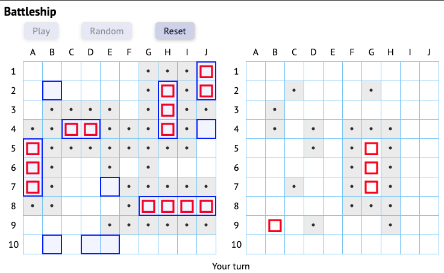

# Battleship
The classic paper and pencil game of Battleship remade for modern browsers with ReactJS and TDD.
This project was made for an Odin Project [curriculum](https://www.theodinproject.com/courses/javascript/lessons/battleship).
The main objective of this project to to practice test drive development (TDD) principles with Jest.
I've also used this opportunity to work with ReactJS using functional components with React hooks. 

### [Play Online](https://winplam.github.io/battleship/)

## Objectives
* Test Driven Development (TDD) with Jest testing framework
* Use functional components with React hooks
* SASS usage organized with modules
* Mobile first with responsive design

## Key Concepts
* Test Driven Development (TDD)
* Factory Function
* Object Oriented Programming (OPP)
* Model View Controller (MVC)

## Run Locally
Clone repository
`git clone git@github.com:winplam/battleship.git`
Run `yarn install`
Run `yarn start`
Point  your browser to `http://localhost:3000/`

Tests: run `yarn test`

## Tools Used
React, Jest, HTML, SASS/CSS, JavaScript, CreatReactApp, Webpack

### MIT License